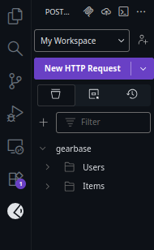
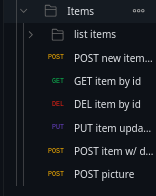
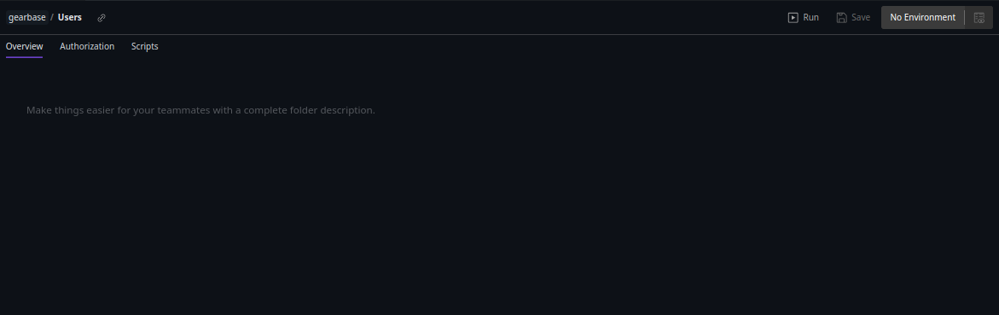

# Testing API Endpoints with Postman

When writing code for API endpoints, it is often helpful to use an external tool to test the endpoints while building them. cURL is one possibility, but I find it much easier and more convenient to use [Postman](https://www.postman.com/). Testing directly within my editor, VS Code, is even more convenient. I have been using the [Postman VS Code extension](https://marketplace.visualstudio.com/items?itemName=Postman.postman-for-vscode) for this. However, this extension has some notable flaws.

The most prominent issues for me are the layout of the extension and the ineffective folder view. 

As shown above, opening the extension for the first time brings up a sidebar view. This narrow view places unnecessary limits on the meaningful titles available to a user because so few characters are visible. This reduces the **efficiency** afforded by using this software. When I need to quickly find one of the test endpoints with a longer title, I instead have to hover my mouse over it to bring up the title or click on it to view it. Efficiency is reduced because I'm wasting time looking through the titles.

On top of reducing **efficiency**, this also reduces my **satisfaction** when using this application, because the interaction becomes frustrating.

The other issue is the folder view. This extension allows you to organize your tests into folders. Clicking on a folder brings up an entire tab full of wasted space. I expect to get a full list of the tests within the folder. What I see instead is this:

How useful is this? Not very. This mismatch in expectation and reality tells me that there is a discrepancy between my **mental model** and the **conceptual model** presented to me. If there was instead a list of the tests in the folder, perhaps with some quick action buttons to run the tests, there would not be so much wasted space on screen. As it is, these folder tabs waste a bit of time and don't present any useful information or utility to me.

These issues illustrate how poor alignment between interface design and user expectations can lower both efficiency and satisfaction. Improving the layout to show longer titles and presenting folders as true collections of tests would better match users’ mental models. While the Postman VS Code extension is convenient in theory, its current design falls short of this goal.
